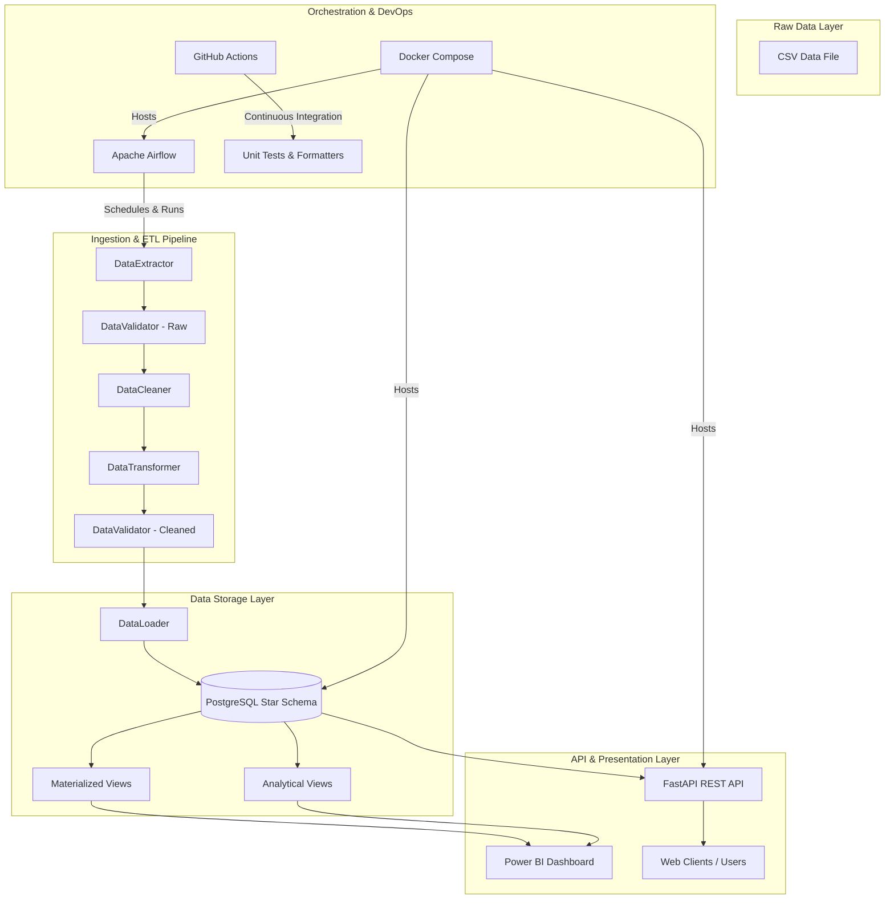

# Retail Data Warehouse & Sales Analytics Platform

[](https://www.python.org/downloads/release/python-3120/)
[](https://www.postgresql.org/)
[](https://fastapi.tiangolo.com/)
[](https://docs.docker.com/compose/)
[](https://github.com/yourusername/retail-analytics-platform/actions)
[](https://opensource.org/licenses/MIT)

An end-to-end, production-grade analytics platform capable of ingesting raw retail sales transaction data, validating quality metrics, transforming and feature engineering dataframes, loading into a PostgreSQL Star Schema warehouse, generating analytical views, and exposing data via a FastAPI REST service and Power BI dashboards.

This repository is designed specifically as a resume-worthy portfolio project for Junior Data Analyst / Junior Data Engineer interviews at companies like Indium Software.

---

## 1. System Architecture

The following diagram illustrates the complete, modular data architecture:



For a comprehensive breakdown, see the [System Architecture Documentation](docs/architecture.md).

---

## 2. Key Features

- **Robust Ingestion Pipeline**: Auto-detects encoding (via `chardet`), validates schemas, handles missing values, and coercing datatypes.
- **Custom Data Quality Framework**: Evaluates data quality metrics (nulls, ranges, duplicates, business rules), emitting structured validation reports.
- **Enterprise Star Schema**: Optimized warehouse schema in PostgreSQL containing 5 dimensions and 1 fact table.
- **SCD Type 2 Versioning**: Implements Slowly Changing Dimensions (SCD) Type 2 on customer attributes to preserve historical profile metrics.
- **PostgreSQL Range Partitioning**: `fact_sales` is partitioned by year to prune scans and optimize query times.
- **FastAPI REST Service**: Exposes pagination, filters, and dashboard aggregate data.
- **Power BI Specifications**: Curated dark glassmorphism theme, 25+ DAX measures, and Row-Level Security parameters.
- **Dockerized Deployments**: PostgreSQL, redis, and Airflow services packaged inside docker-compose.
- **GitHub Actions CI**: Automated formatting checks (Black, isort) and pytest execution on SQLite mock environments.

---

## 3. Tech Stack

- **Core**: Python 3.12, SQL (PostgreSQL 16)
- **ETL & Analytics**: Pandas, NumPy, SQLAlchemy 2.0
- **Web API**: FastAPI, Pydantic v2, Uvicorn
- **Orchestration & DevOps**: Apache Airflow 2.9, Docker & Docker Compose, GitHub Actions
- **Testing**: Pytest, Pytest-cov, HTTPX
- **Reporting**: Power BI Desktop

---

## 4. Quick Start

Ensure you have [Docker Desktop](https://www.docker.com/products/docker-desktop/) and [Python 3.12](https://www.python.org/downloads/) installed.

### Step 1: Clone and Configure Environment
```bash
git clone https://github.com/yourusername/retail-analytics-platform.git
cd retail-analytics-platform
cp .env.example .env
```

### Step 2: Install Python Dependencies
Using [Poetry](https://python-poetry.org/):
```bash
poetry install
```
Using virtualenv and pip:
```bash
python -m venv venv
source venv/bin/activate
pip install -r requirements.txt
```

### Step 3: Start Infrastructure Services
Use Docker Compose to spin up PostgreSQL, Redis, and Airflow:
```bash
docker-compose up -d
```
Verify containers are running:
```bash
docker-compose ps
```

### Step 4: Setup Schema and Generate Data
```bash
# Generate synthetic raw retail CSV (~10,000 records)
poetry run python scripts/generate_data.py --rows 10000

# Initialize PostgreSQL database schema, views, and functions
poetry run python scripts/init_db.py --drop
```

### Step 5: Run the ETL Ingestion Pipeline
```bash
poetry run python scripts/run_etl.py
```

### Step 6: Launch API Service
```bash
poetry run uvicorn src.api.main:app --reload --host 0.0.0.0 --port 8000
```
Open [http://localhost:8000/docs](http://localhost:8000/docs) in your browser to view the interactive OpenAPI documentation.

---

## 5. Folder Structure

```
retail-analytics-platform/
├── README.md                 # Professional overview & instructions
├── pyproject.toml            # Poetry configuration and dependencies
├── requirements.txt          # Python dependencies list
├── docker-compose.yml        # Docker infrastructure configurations
├── .env.example              # Template for environment variables
├── .gitignore                # Git exclusions list
├── Makefile                  # Helper CLI commands
├── dags/
│   └── retail_etl_dag.py     # Airflow pipeline orchestrator DAG
├── docs/
│   ├── architecture.md       # Detailed components & flow diagrams
│   ├── star_schema.md        # DB DDL schema, grains, and indexes
│   ├── etl_flow.md           # Modular processing stages details
│   ├── dashboard.md          # Power BI reporting specification
│   ├── api.md                # FastAPI REST endpoint details
│   └── interview_prep.md     # 30 Technical Q&As study guide
├── sql/
│   ├── tables/
│   │   ├── create_dimensions.sql # Dimensions DDL
│   │   ├── create_facts.sql      # Partitioned Fact DDL
│   │   └── create_staging.sql    # Raw staging tables
│   ├── views/                # Reporting & analytical view queries
│   ├── indexes/              # FK, partial, and composite indexes
│   └── stored_procedures/    # PL/pgSQL stored procedures
├── powerbi/
│   ├── dashboard_spec.md     # UI layout specs
│   ├── dax_measures.md       # 25+ real DAX metrics list
│   └── data_model.md         # Relationship & security specs
├── src/
│   ├── config/               # Settings management via Pydantic
│   ├── database/             # SQLAlchemy connection pooling
│   ├── models/               # SQLAlchemy ORM Star Schema models
│   ├── schemas/              # Pydantic v2 API DTO schemas
│   ├── etl/                  # Extract, Clean, Transform, Load modules
│   ├── validation/           # Data Quality validation rules
│   ├── warehouse/            # DB vacuuming & schema controls
│   ├── analytics/            # High-performance DB metrics queries
│   ├── api/                  # FastAPI routers and entrypoint
│   └── utils/                # Logger and helpers
├── tests/                    # Integration and unit tests
└── data/                     # Local file data lake paths
```

---

## 6. Database Star Schema

The warehouse is designed using a **Star Schema** optimized for high-performance reads:

- **Fact Table**: `fact_sales`
- **Dimension Tables**:
  - `dim_customer` (SCD Type 2 tracking customer segment histories)
  - `dim_product` (Product descriptive attributes)
  - `dim_category` (Product hierarchical category mappings)
  - `dim_region` (Geographical locations mapping)
  - `dim_date` (Pre-calculated calendar/fiscal components)

For details on relationships, grains, and constraints, see [Star Schema Documentation](docs/star_schema.md).

---

## 7. REST API Endpoints

| Method | Endpoint | Description |
|--------|----------|-------------|
| **GET** | `/health` | Verifies service and DB connectivity health. |
| **GET** | `/kpis` | Aggregates Net Sales, Profit, Orders, Customers, AOV, and Margins. |
| **GET** | `/customers` | Retrieves paginated list of active customers (filtered by segment). |
| **GET** | `/products` | Retrieves paginated list of products (filtered by category). |
| **GET** | `/sales` | Paginated list of sales transactions (filtered by date, region, category). |
| **GET** | `/dashboard-data` | Composite payload returning KPIs, trends, category, and regional splits. |

Detailed specifications and payload samples are available in the [REST API Documentation](docs/api.md).

---

## 8. Interview Highlights & Q&As

If you are preparing for an interview at a company like Indium Software, make sure to review the [Interview Preparation Study Guide](docs/interview_prep.md). It contains:
- A **2-minute elevator pitch** describing the project architecture.
- A **5-minute comprehensive walkthrough** of code patterns.
- **30 highly technical Q&As** addressing Star Schema design, SCD Type 2, indexes, validation pipelines, data quality scoring, materialized views, range partitioning, and API development.

---

## 9. Future Improvements

1. **dbt Integration**: Migrate SQL views, materialized views, and test suites into dbt models to separate SQL transformations from Python orchestration.
2. **Great Expectations**: Upgrade the custom data validation framework to use Great Expectations for advanced profiling.
3. **Kafka Streams**: Implement real-time ingest using Apache Kafka to consume transactional events instead of CSV files.
4. **Cloud Migration**: Migrate the warehouse schema to Snowflake or Google BigQuery to test massive parallel processing scale.

---

## 10. License

Distributed under the **MIT License**. See `LICENSE` for details.
