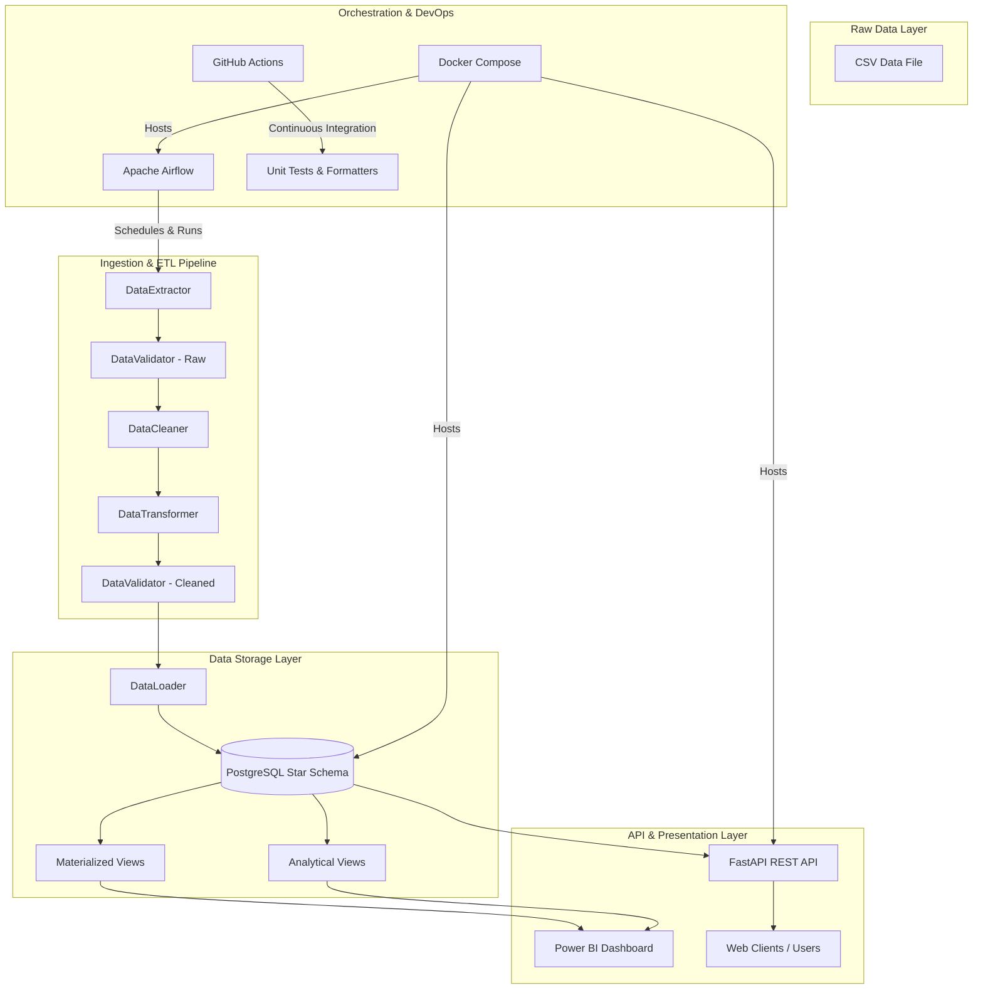

# System Architecture Documentation

This document describes the high-level architecture of the **Retail Data Warehouse & Sales Analytics Platform**. The platform is designed to handle raw transactional ingest, clean and validate it, load it into a star schema warehouse, and serve analytical queries through a REST API and Power BI reporting interfaces.

---

## 1. System Overview

The following diagram illustrates the end-to-end data pipeline flow:

---

## 2. Component Breakdown

### A. Raw Data Layer
- **Source File**: `superstore_sales.csv` containing ~10,000 retail sales transactions.
- **Attributes**: Order ID, Dates, Customer Details, Product Hierarchy, Geographies, and financial details (Sales, Quantity, Discount, Profit).

### B. ETL Ingestion Pipeline (`src/etl/`)
- **Extractor**: Reads CSV files, automatically detects encoding (via `chardet`), and validates base schema definitions (required columns).
- **Validator**: Checks for nulls, duplicate keys, numeric ranges (e.g. Quantity > 0), and ensures dates satisfy `Order Date <= Ship Date`. Emits quality reports with a percentage score.
- **Cleaner**: Standardizes data types (e.g. strings to float/datetime), handles missing values, trims string whitespaces, and filters out invalid records.
- **Transformer**: Normalizes dimensions (like categories, sub-categories, regions), runs Outlier Detection using the Interquartile Range (IQR) method, and performs feature engineering (derived Net Revenue, Profit Margins, and time fields).
- **Loader**: Loads dimensions (using surrogate keys) and the fact table (resolving keys). Implements **Slowly Changing Dimensions (SCD) Type 2** for customer attribute history tracking.

### C. Warehouse Layer (`sql/` & `src/warehouse/`)
- **Star Schema**: Comprised of 5 dimension tables (`dim_customer`, `dim_product`, `dim_region`, `dim_date`, `dim_category`) and one partitioned fact table (`fact_sales`).
- **Partitioning**: Range partitioned by year (`order_date_key`) for enhanced performance.
- **Views**: 7 analytical database views (e.g. customer segmentation, monthly trends) to speed up complex queries.
- **Stored Functions**: For modular aggregations and refreshing materialized views.

### D. REST API Layer (`src/api/`)
- Exposes REST endpoints built on **FastAPI** to serve parsed data payload:
  - `/health` (DB check)
  - `/kpis` (financial cards)
  - `/customers` (SCD profile query)
  - `/products` (hierarchical catalog lookup)
  - `/sales` (parameterized transactions)
  - `/dashboard-data` (consolidated chart data)

### E. Power BI Layer (`powerbi/`)
- Connects directly to PostgreSQL tables, views, and materialized views to render 5 custom dashboard pages (Executive KPIs, Regional Map, Customer Segmentations, Product Performance, and Time Series trends).

---

## 3. Technology Stack & Rationale

| Technology | Role | Rationale |
|------------|------|-----------|
| **Python 3.12** | Core Language | Standard in modern data engineering; rich libraries for data manipulation and testing. |
| **PostgreSQL 16** | Relational OLAP | Open-source enterprise DBMS; robust support for schemas, range partitioning, and PL/pgSQL stored procedures. |
| **SQLAlchemy 2.0** | ORM / Core SQL | Modern object-relational mapping; handles table creation, data types, connection pooling, and secure queries. |
| **Pandas / NumPy** | Data Manipulation | Standard vector processing libraries; simplifies cleaning, feature engineering, and outlier math. |
| **FastAPI** | REST API | Extremely fast web framework; auto-generates OpenAPI documentation and integrates seamlessly with Pydantic. |
| **Apache Airflow** | DAG Orchestration | Industry standard for scheduling pipelines, handling task dependencies, retries, and failure alerts. |
| **Docker Compose** | Deployment | Packages PostgreSQL, redis, webserver, and scheduler to run consistently across any environment. |
| **Pytest** | Testing | Clean unit and integration testing suite; supports transactional databases and client mocking. |

---

## 4. Key Design Patterns

- **Orchestrator Pattern**: `ETLPipeline` acts as the single entry point coordinating Extract, Clean, Validate, Transform, and Load steps.
- **Data Transfer Objects (DTO)**: Pydantic v2 schemas isolate API inputs and outputs from ORM database models, ensuring separation of concerns.
- **Slowly Changing Dimensions (SCD) Type 2**: Customer dimensions implement `effective_date`, `expiry_date`, and `is_current` columns to track history over time rather than overwriting profiles.
- **Batch Processing**: Database loads process records in configurable batch chunks (default 1,000) using SQLAlchemy bulk insert methods to optimize throughput.
