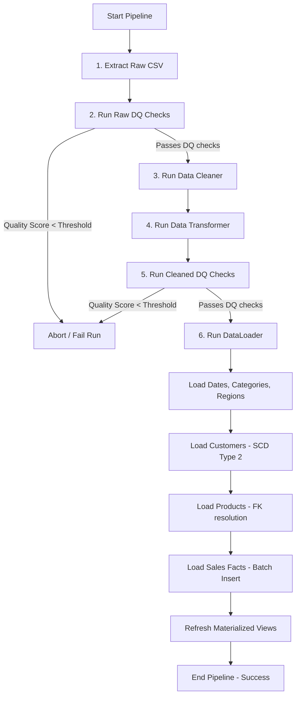

# ETL Pipeline Flow Documentation

This document describes the workflow, data processing logic, and components of the **Retail Data Warehouse Ingestion (ETL) Pipeline**.

---

## 1. ETL Workflow Overview

The ETL pipeline operates on a batch load paradigm, moving data from raw CSV files into staging tables, performing validations, cleaning, transformations, and finally loading the records into the Star Schema.

---

## 2. Pipeline Stages

### Stage 1: Extraction (`extractor.py`)
- **Encoding Detection**: Reads the binary preamble of the CSV using `chardet` to detect character set encodings (e.g. `UTF-8` vs `ISO-8859-1`), avoiding character corruption.
- **Schema Conformity**: Checks if the file contains all 21 required columns of the retail superstore format. Raises a `ValueError` immediately on schema mismatch.
- **Metrics Logging**: Logs input file size, row counts, and column counts.

### Stage 2: Quality Validation (`validator.py`)
- Executes automated assertions across the DataFrame:
  - **Nulls**: Checks critical fields (IDs, Sales, Quantities).
  - **Duplicates**: Verifies that duplicate composite keys (`Order ID` + `Product ID`) do not exist.
  - **Ranges**: Verifies values: `Sales > 0`, `Quantity > 0`, `0 <= Discount <= 1`.
  - **Business Rules**: Order Date must be on or before Ship Date.
- Emits a weighted **Data Quality Score** out of 100%. If critical checks fail, the run is terminated.

### Stage 3: Cleaning (`clean.py`)
- **Type Coercion**: Converts datetimes, integers, and floats.
- **Postal Code formatting**: Standardizes numeric string formatting for postal codes (handling floating-point noise from CSVs).
- **Trimming**: Strips trailing and leading whitespaces from all strings.
- **Fills**: Populates missing non-critical fields with generic defaults (e.g. "Unknown Customer", "Unknown City").

### Stage 4: Transformation & Feature Engineering (`transformer.py`)
- **Casing Normalization**: Standardizes Category and Region spellings to consistent casing (e.g. "tech" -> "Technology").
- **Outlier Tagging**: Identifies financial outliers using the **IQR method** (values outside $[Q1 - 1.5 \times IQR, Q3 + 1.5 \times IQR]$) and flags them with an `is_outlier` boolean.
- **Feature Engineering**:
  - `Revenue` = `Sales * (1 - Discount)`
  - `Profit_Margin` = `Profit / Sales`
  - `Order_to_Ship_Days` = `Ship Date - Order Date`
  - Date segments (Year, Quarter, Month, Month Name, Day of Week).

### Stage 5: Loading (`loader.py`)
Loads target tables sequentially using SQLAlchemy session transactions:
1. **`dim_date`**: Generates and bulk inserts any missing dates between order/ship bounds. Calculates calendar and fiscal attributes.
2. **`dim_category`**: Loads unique categories.
3. **`dim_region`**: Loads unique geographies.
4. **`dim_customer`**: Implements **SCD Type 2** tracking.
5. **`dim_product`**: Resolves category IDs to surrogate category keys.
6. **`fact_sales`**: Performs bulk cache lookups to map natural keys (IDs) to database surrogate keys. Inserts transactional facts in batch sizes of 1,000.

---

## 3. Error Recovery & Performance

- **Atomic Transactions**: Each warehouse load step is encapsulated in a SQLAlchemy transaction session. If any chunk fails, the database automatically rolls back to the previous state.
- **In-Memory Caching**: The loader pre-caches all dimension keys before processing fact rows, avoiding redundant database lookups.
- **Partition Pruning**: In PostgreSQL, the range partitioned `fact_sales` table allows the query planner to scan only target partition tables, dramatically reducing I/O search times.
