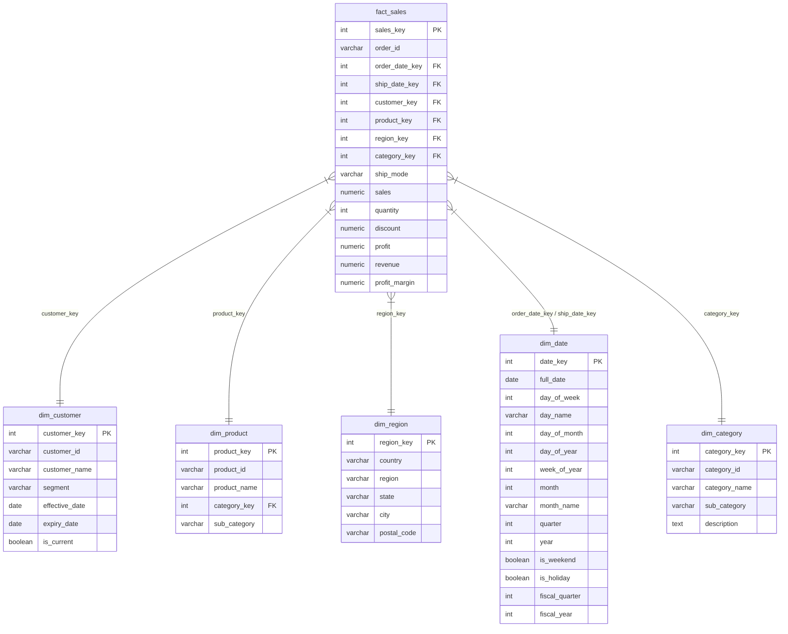

# Data Warehouse Design & Star Schema Documentation

This document describes the database design for the **Retail Data Warehouse & Sales Analytics Platform**. The database uses a **Star Schema** architecture optimized for analytical query performance, simple joins, and reporting tools like Power BI.

---

## 1. Schema Overview

The database is designed around a single central fact table and five surrounding dimension tables:

---

## 2. Table Schemas & Grain

### Central Fact Table: `fact_sales`
- **Grain**: One record per order line item.
- **Measures**:
  - `sales`: Gross transaction amount.
  - `quantity`: Count of items sold.
  - `discount`: Applied rate (0.00 to 1.00).
  - `profit`: Net gain/loss after subtracting costs.
  - `revenue`: Net sale amount calculated as `Sales * (1 - Discount)`.
  - `profit_margin`: Margin calculated as `Profit / Sales`.

### Dimension Tables

1. **`dim_customer` (SCD Type 2)**:
   - **Grain**: One record per version of customer profile.
   - Tracks changes to segment or name. Uses `effective_date`, `expiry_date`, and `is_current` columns.

2. **`dim_product`**:
   - **Grain**: One record per distinct product code.
   - Maps products to sub-categories and links up to `dim_category`.

3. **`dim_category`**:
   - **Grain**: One record per category/sub-category combination.
   - Separated from product to ease hierarchical filtering.

4. **`dim_region`**:
   - **Grain**: One record per distinct geographical combination of Country, Region, State, City, and Postal Code.

5. **`dim_date`**:
   - **Grain**: One record per calendar date.
   - Pre-calculates fields like year, quarter, month, day name, fiscal year, and weekends to avoid runtime conversions.

---

## 3. Slowly Changing Dimensions (SCD) Type 2

The customer dimension is designated as an **SCD Type 2** table to preserve historical reporting accuracy.

- When a customer changes their segment (e.g. from "Consumer" to "Corporate"):
  1. The database finds the current active record (`is_current = TRUE`).
  2. Updates it setting `is_current = FALSE` and `expiry_date` to `Order Date - 1 day`.
  3. Inserts a new row with the updated segment, setting `is_current = TRUE`, `effective_date` to `Order Date`, and `expiry_date` to `NULL`.
- This ensures that transactions made under the old segment remain linked to the historical profile, while new transactions link to the updated profile.

---

## 4. Indexing & Partitioning Strategies

### Indexes
- **Primary Keys**: Automatically indexed as unique B-tree indexes.
- **Foreign Keys**: Individual B-tree indexes are created on `order_date_key`, `ship_date_key`, `customer_key`, `product_key`, `region_key`, and `category_key` in `fact_sales` to accelerate joins.
- **Partial Indexes**: A partial index on `fact_sales` where `profit < 0` is created to optimize audits on loss-making orders.

### Range Partitioning
- The `fact_sales` table is range partitioned by `order_date_key` into annual tables:
  - `fact_sales_2021` (values >= 20210101 and < 20220101)
  - `fact_sales_2022` (values >= 20220101 and < 20230101)
  - `fact_sales_2023` (values >= 20230101 and < 20240101)
  - `fact_sales_2024` (values >= 20240101 and < 20250101)
  - `fact_sales_2025` (values >= 20250101 and < 20260101)
  - `fact_sales_default` (fallbacks)
- Allows PostgreSQL to prune partitions during query execution, leading to faster analytical reports filtering by year.
